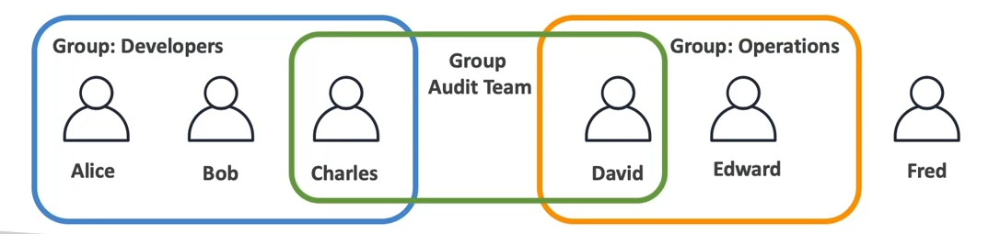
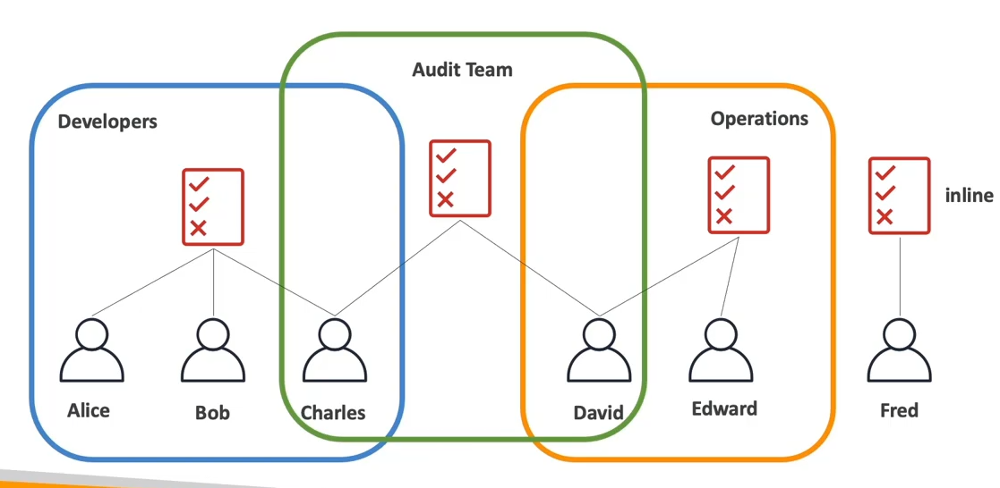
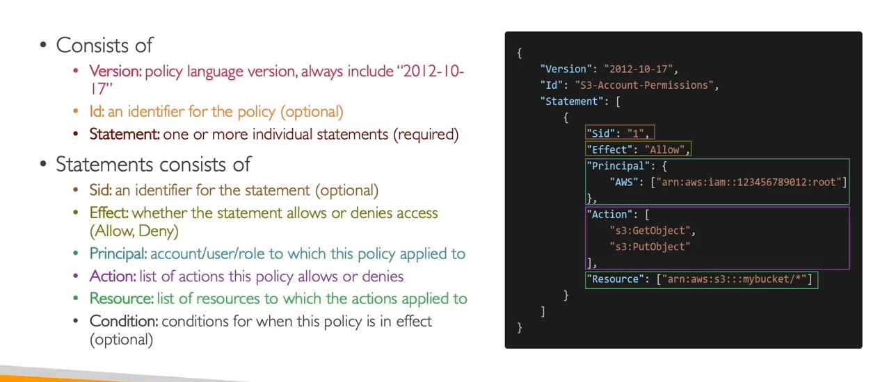

# IAM: Introduction Users, Groups, Polices

## IAM

<b>1. IAM Introduction</b>

- **IAM** = Identity and Access Management, global service  
  - **Root account**: created by default, do not share or use routinely  
  - **Users**: individuals in your organization, can be grouped  
  - **Groups**: contain users only, not other groups  
  - Users may belong to zero or multiple groups  
- 

<b>2. IAM Policies Overview</b>

- **Policy**: JSON document that defines permissions  
  - Attach to users, groups, or roles  
  - Two types: **Managed** and **Inline**  
- Three policy categories  
  1. **Identity-based policies**  
  2. **Resource-based policies**  
  3. **Permissions boundaries**

- **IAM Policies inheritance**: 
  -   
  
- **IAM Policies structure**: 
  -   

