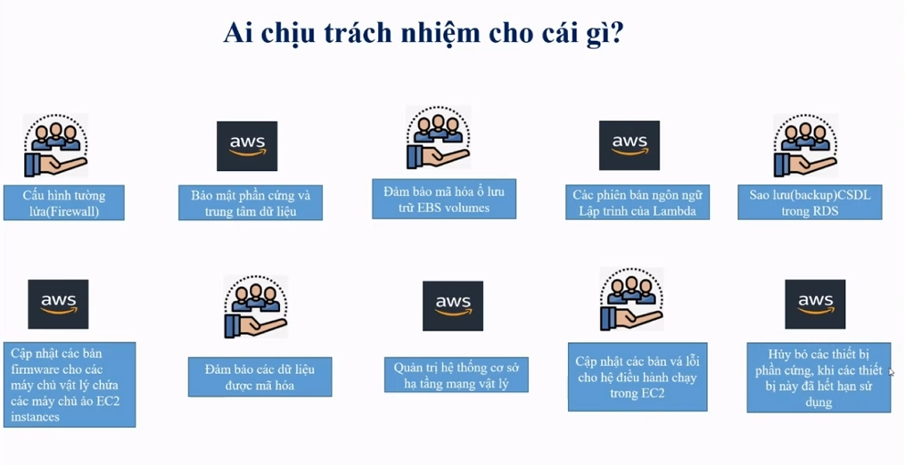
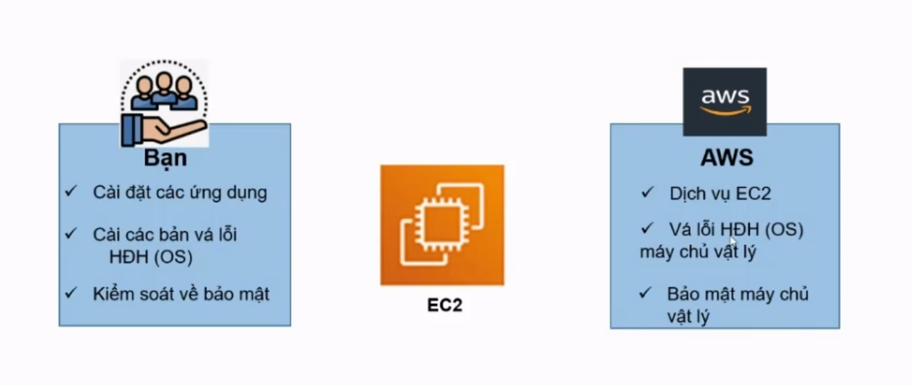
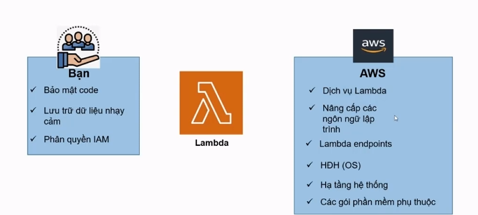
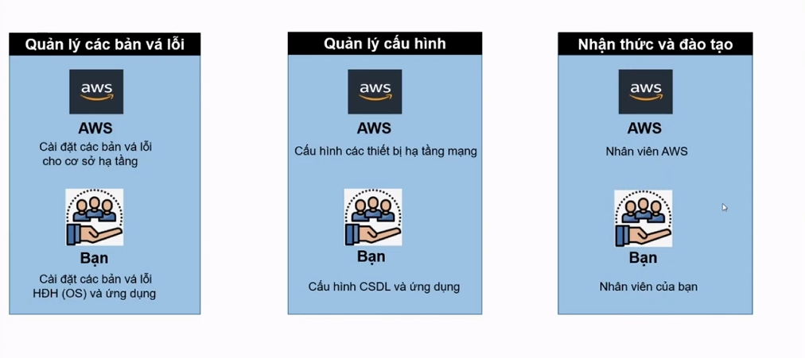

# My-Learning-AWS
Đây là một repository cá nhân của tôi trong quá trình học AWS

## Tổng quan về Amazon Web Service (AWS)

 

  <b>AWS Overview: </b>
 

  
  - <b> AWS là gì? </b> ` Amazone Web Services ` (AWS) là nền tảng dịch vụ đám mây an toàn,
  mang đến khả năng tính toán, lưu trữ cơ sở dữ liệu, phân phối nội dung và chức năng khác
  nhằm giúp các doanh nghiệp mở rộng và phát triển.
  - <b> Dịch vụ AWS cung cấp gồm: </b>
    + <b> Compute: </b>
      + Amazon Elastic Computer Cloud (EC2): dịch vụ máy ảo.
      + Elastic Load Balacing (ELB): dịch vụ cân bằng tải.
      + AWS Lambda: dịch vụ triển khai code không server (serverless).
      + AWS Elastic Beanstalk: triển khai các ứng dụng web.
      + VM Import/Export: import/export ảnh các máy ảo.
    + <b> Storeage and Content Delivery: </b>
      + Amazon S3: dịch vụ lưu trữ đối tượng.
      + Amazon Glacier: dịch vụ lưu trữ dữ liệu ít truy cập.
      + Amazon Elastic Book Store (EBS): dịch vụ lưu trữ dạng khối, phục vụ cho EC2 nhưng độc lập EC2.
      + Amazon Elastic File System (EFS): dịch vụ lưu trữ và chia sẻ file.
      + Amazon CloudFont: dịch vụ lưu trữ và chia sẻ file.
      + Amazon Storage Gateway: dịch vụ cổng lưu trữ dữ liệu.
      + Amazon AWS Import/Export Snowball: dịch vụ di chuyển dữ liệu trực tiếp lên đám mây của AWS.
    + <b> Database: </b>
      + Amazon RDS: dịch vụ cơ sở dữ liệu mô hình quan hệ Amazon Aurora, Oracle, Microsoft SQL Server, PostgreSQL, MySQL & MariaDB.
      + Amazon DynamoDB: dịch vụ cơ sở dữ liệu NoSQL của Amazon.
      + Amazon Redshift: dịch vụ kho dữ liệu của Amazon.
      + Amazon ElastiCache: dịch vụ cache dữ liệu của Amazon.
    + <b> Networking: </b>
      + Amazon VPC: dịch vụ mạng riêng ảo.
      + Amazon Direct Connect: dịch vụ thiết lập kết nối dành riêng từ AWS đến DataCenter.
      + Amazon Route53: dịch vụ quản lý tên miền DNS và định tuyến đến các dịch vụ của AWS.
    + <b> Developer tools: </b>
      + Amazon CodeCommit: dịch vụ quản lý code, có thể giao với git.
      + Amazon CodeDeploy: dịch vụ triển khai code tự động lên các máy chủ EC2, Lambda.
      + Amazon CodePipeline: dịch vụ liên quan đến code như cập nhật, biên dịch, test, ...
    + <b> Management tools: </b>
      + Amazon CloudWatch: giám sát các nguồn tài nguyên.
      + AWS CloudFormation: quản lý các nguồn tài nguyên.
      + AWS CloudTrial: dịch vụ lưu lại lịch sử hoạt động các dịch vụ.
      + AWS Config: dịch vụ quản lý cấu hình AWS.
      + AWS OpsWorks: dịch vụ định nghĩa cấu trúc ứng dụng.
      + AWS Service Catalog: dịch vụ quản lý danh mục dịch vụ IT trên AWS.
      + AWS Trusted Advisor: công cụ trực tuyến giám sát giới hạn dịch vụ.
    + <b> Security and Identity: </b>
      + AWS Identity and Access Management: quản lý người dùng và quyền truy cập dịch vụ AWS.
      + AWS Key Management Service (KMS): quản lý khóa mã hóa dịch vụ.
      + AWS Directory Service: quản lý và truy cập các tài nguyên dễ dàng.
      + AWS WAF: dịch vụ tường lửa cho các ứng dụng web.
      + AWS CloudHSM: dịch vụ bảo mật cho các mô đun phần cứng. Sinh và quản lý khóa mã hóa.
  - Mô hình chia sẻ và trách nhiệm trong bảo mật AWS:
    + Mô tả chung chia sẻ trách nhiệm giữa người dùng và AWS:
      +  
    + Mô hình chia sẻ trách nhiệm của EC2:
      +  
    + Mô hình chia sẻ trách nhiệm Lamda:
      +  
    + Các trách nhiệm bảo mật nào được chia sẻ? 
      +   
  - Sáu trụ cột của khung kiến trúc tối ưu AWS (Well-Architected Framework Pillars)
    + <b> Operational Excellence (Vận hành xuất sắc): </b> Vận hành và giám sát các hệ thống để mang lại giá trị kinh doanh và 
    liên tục cải tiến các quy trình và thủ tục.
    + <b> Security (Tính bảo mật): </b> Bảo mật các thông tin và hệ thống.
    + <b> Reliability (Tính tin cậy): </b> Tập trung vào khối lượng công việc thực hiện đúng chức năng và cách hồi phục nhanh chóng
    sau sự cố để đáp ứng nhu cầu.
    + <b> Performance Efficiency (Hiệu quả hiệu suất): </b> Sử dụng IT và tài nguyên điện toán đám mây một cách hiệu quả.
    + <b> Cost Optimization (Tối ưu hóa chi phí): </b> Tránh các chi phí không cần thiết.
    + <b> Sustainability (Tính bền vững): </b> Giảm thiểu các tác động tới môi trường trong việc chạy các hệ thống tài nguyên trong đám mây.
  - Các trách nhiệm bảo mật nào được chia sẻ? 

